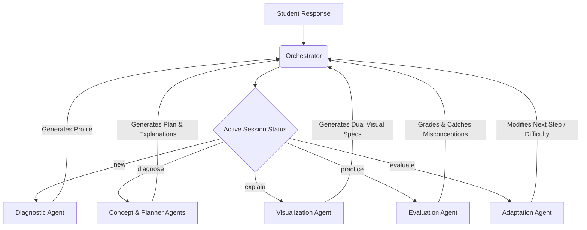

# Adaptive Learning DSA Platform

An intelligent, multi-agent computer science learning platform that diagnoses developer understanding, formulates custom educational paths, visualizes algorithm internals, evaluates explanation reasoning, and adapts lessons dynamically based on student misconceptions.

---

## 🌟 Key Features

1. **Static Problem Context**: Provides clear problem statements, examples, and constraints before initial diagnosis, solving the cold-start comprehension issue.
2. **Initial Assessment & Plan Generation**: Gauges candidate strategy (with a dedicated beginner route) to diagnose understanding and generate a tailored study roadmap.
3. **Visualizer Player**: Features autoplay, speed control, manual stepping, and custom highlight states (including index mappings for hash map comparisons).
4. **Checkpoint Question Page-Turners**: Allows candidate pagination through multiple checkpoint questions returned by the visualization spec.
5. **Real-time Reasoning Evaluation**: Integrates a structured LLM Evaluation Agent that analyzes student answers against canonical key facts to identify specific misconceptions.
6. **Closed-Loop Adaptation Retry Path**: Implements an Adaptation Agent that dynamically triggers curriculum pivots (e.g. `re-teach`, `hint`, `simplify`, or `flag_misconception`) routing the student back to visualizer or practice steps with custom tutoring nudges.

---

## 🛠️ System Architecture

The platform is designed around a multi-agent curriculum pipeline managed by a centralized session orchestrator:



### Backend Agent Directory
* **Diagnostic Agent**: Gauges understanding level, logs self-described goals, and flags missing prerequisites.
* **Concept Agent**: Generates core conceptual explanations, key facts, and teaching emphasis areas.
* **Planner Agent**: Structures the chronological step-by-step roadmap.
* **Visualization Agent**: Returns dual step-by-step debugger visualization specs for both Brute Force and Hash Map methods.
* **Evaluation Agent**: Analyzes student answers, grades factual correctness, and checks for misconceptions.
* **Adaptation Agent**: Determines lesson transitions and difficulty adjustments based on grading outcomes.

---

## 📂 Project Directory Structure

```text
├── backend/
│   ├── app/
│   │   ├── main.py             # FastAPI App definition & router endpoints
│   │   ├── orchestrator.py     # Centralized session state transitions
│   │   ├── agents.py           # Real agent prompts and LLM wrappers
│   │   ├── schemas.py          # Pydantic schemas for type safety
│   │   ├── llm_client.py       # Groq/xAI/OpenAI API key resolving client
│   │   ├── state_store.py      # Session memory caching
│   │   └── domain.py           # Core DSA concept adapter structures
│   ├── verify_session_flow.py  # End-to-end API compliance test script
│   ├── run_eval_comparison.py  # Pipeline vs Baseline agent test script
│   └── run_five_problems_eval.py # Multi-problem scaling verification test script
├── frontend/
│   ├── src/
│   │   ├── main.jsx            # React app and visualizer layouts
│   │   └── index.css           # Styling sheets
│   └── package.json            # Vite configuration and scripts
├── README.md                   # Platform Overview
├── CHANGELOG.md                # Development Log & Timeline
├── REPRODUCTION_GUIDE.md       # Environment setup & script execution manual
└── SUBMISSION.md               # Checked submission package

```

---

## 🚦 Quick Start

Refer to [REPRODUCTION_GUIDE.md](file:///c:/Users/bhava/Documents/GitHub/Micron%20Hackathon/REPRODUCTION_GUIDE.md) for full setup instructions.

1. **Define environment variables** in `backend/.env`.
2. **Boot the backend**:
   ```powershell
   cd backend
   .\venv\Scripts\activate
   python -m uvicorn app.main:app --port 8000
   ```
3. **Boot the frontend**:
   ```powershell
   cd frontend
   npm run dev
   ```
4. **Access the platform** at `http://localhost:5173/`.
